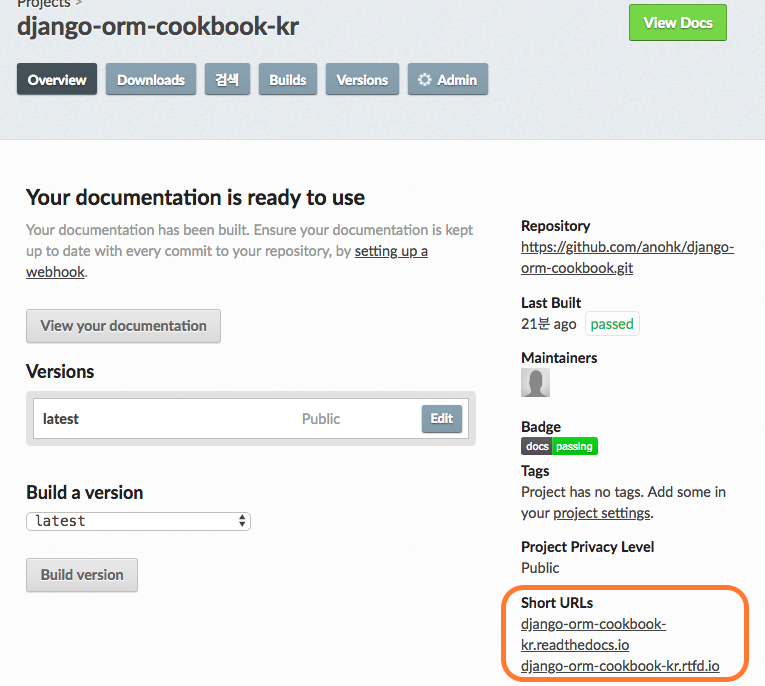
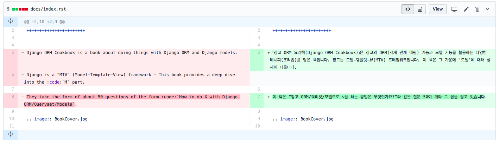

# 여정의 시작

8퍼센트에서는 여전히 스터디가 꾸준히 이어지고 있다. 스터디를 마치면 자연스레 다음엔 무엇을 해볼까? 하는 기대감이 생기곤 한다. 이번에는 회사에서 메인으로 사용하고 있는 Django에 대해 조금 더 알아보고, 업무에도 바로 적용해 볼 수 있는 스터디를 하기로 결정했다.

호성님의 제안으로 우리는 [Django ORM Cookbook](http://books.agiliq.com/projects/django-orm-cookbook/en/latest/) 책을 공부해 보기로 했다. Django ORM Cookbook은 Django의 ORM과 모델의 다양한 기능을 활용하는 방법들을 다루고 있다.  

스터디를 본격적으로 시작하기 전에 스터디 멤버들이 모두 모여, 스터디를 어떻게 진행하면 좋을지 이야기를 나누었다. 이 과정에서, 오픈소스 문서를 한글로 번역해서 공유하자는 아이디어가 나왔고 바로 실행해보기로 했다.


먼저 원저자에게 이메일로 연락을 해보았다. 한글 번역으로 오픈소스에 기여라니! (개인적으로는 처음 해보는 것이라 매우 기대되었다.)

이 문서로 스터디를 하면서 한글 번역에 기여해보고싶다. 가이드가 있을까요? 정도의 짧은 문장을 적어 메일을 보냈다. 늦은 밤에 메일을 보냈더니 바로 답장이 왔다. 원저자는 매우 기뻐했고, sphinx와 readthedocs를 이용해보라는 이야기를 해주었다. 도움이 필요하면 언제든 연락주라는 이야기와 함께.


# 문서는 어떻게 만드나요?

Read the docs와 Sphinx는 처음 사용해보는 것인데, 호성님께서 스터디 시간에 간략히 설명을 해주셨다. 


## Read the docs

- 소프트웨어의 문서를 생성하고, 버전을 매기고, 호스팅하는 목적이다.
- 대부분의 파이썬 오픈소스 프로젝트가 이 사이트를 이용하며 무료이다.
- 호스팅도 하지만 직접 설치해서 쓸 수 있고, private 호스팅도 지원한다.


Read the docs를 세팅하는 것은 생각보다 간단했다.

1. [Django ORM Cookbook GitHub repository](<https://github.com/agiliq/django-orm-cookbook>) 를 fork 한다.

2. readthedocs.org 에 가입하여 프로젝트를 생성한다.

	

3. 프로젝트를 임포트한다.

	

4. GitHub 연결하여 fork 떠둔 Repository를 선택한다.

	

5. Project Name 변경. 
   여기에서 원 repository의 프로젝트 이름과 겹치지 않도록 프로젝트 이름을 적절하게 변경해주어야한다.

	

6. web hook 확인  
   repository에서 pr/push를 하게되면 해당 내용을 자동으로 업데이트해준다.

	

	

7. 제공된 Short URL로 접근해보면, 결과를 확인해볼 수 있다.

	


8. 번역문서 PR을 만들고, 마스터에 병합하면 사이트에 반영이 된다.

	

	

PR을 만들 때 주의할 점은 자신이 포크를 떠놓은 repository에 PR을 해야한다는 것이다.  

원 repositroy가 기본 세팅되어 있어서 영문서 repository에 번역 PR을 보내버리는 실수를 하기도 했었다. 


## Sphinx

- 개발자가 문서를 만들어 내기 위한 도구. reStructuredText 를 마크업 언어로 사용한다.
- 내부적으로는 docutils 를 사용한다. 
- 파이썬 문서를 잘 만들기 위해서 시작되었지만 다른 언어의 프로젝트에도 사용될 수 있다. 
- 예를 들면 rst 에서 HTML, LaTeX, PDF, ePub 등을 만들어 낼 수 있다.
- <http://www.sphinx-doc.org/en/master/>
- <http://www.sphinx-doc.org/en/master/usage/quickstart.html> 에서 tutorial 을 볼 수 있다.


fork 한 repository를 로컬에서 클론 받아 가상환경을 세팅한 후 Sphinx를 설치해보았다. `pip install sphinx` 로 설치를 하고 html 빌드를 해보면 sphinx_rtd_theme을 설치해야한다는 에러가 뜬다. config 파일을 보면 html_theme 에  sphinx_rtd_theme 를 사용하고 있다는 것을 알 수 있다.

`pip install sphinx_rtd_theme` 로 테마를 설치해준 후, 다시 빌드 해주었다.

```
sphinx-build . ./_build/html/
```

docs/_build/html/index.html 파일을 열어보면 빌드가 잘 된 것을 확인할 수 있다.


### PDF로 변환하기

rst 문서는 latex 라는 형식을 거쳐 pdf 로 변환할 수 있다.


- https://www.latex-project.org/get/ 에서 mactex(Unix의 경우) 를 다운받아 설치한다.

- /docs 위치에서 `sphinx-build -b latex . _build/latex` 명령어로 latex를 생성한다.

- /docs/_build/latex (Makefile 이 위치한 곳)에서 `make all-pdf`로 pdf 를 생성한다.


그런데 한글 문서이다보니 pdf 변환 전에 해야할 일이 조금 더 있다. 

한글 폰트를 사용하는 경우, 다음과 같이 DjangoORMCookbook.tex 파일의 내용을 살짝 바꾸어 준다.

```
sed -i '' 's/\[T1\]{fontenc}/{kotex}/g' ./_build/latex/DjangoORMCookbook.tex
sed -i '' 's/{babel}/\[english\]{babel}/g' ./_build/latex/DjangoORMCookbook.tex
```

위 과정을 마치고 `make all-pdf` 를 사용하여 pdf 파일을 생성한다. 


# 번역을 마치다

Django ORM cookbook의 각 장은 간단한 설명과 예제 코드로 이루어져있다. 내용이 그리 길지 않기 때문에, 스터디 멤버들이 어떻게 하면 문서를 골고루 (반 강제적으로 ^^) 볼 수 있을지 고민하다 각 스터디 시간마다 발표자와 번역자를 따로 두기로 했다. 매번 2명의 발표자와 2명의 번역자를 두고 스터디를 진행했다.

문서를 보다보니 오타나 문법오류로 페이지에 보이지 않던 내용도 있었다. 팀원들과 번역을 하면서 이러한 오류를 발견하고 바로잡는 재미가 쏠쏠했다.

번역을 함께 하다보면 으레 그렇듯 각자의 번역 어투가 달랐고 문서를 모아보니 전반적으로 퇴고를 해야할 필요성을 느꼈다. 이 부분은 [[컴퓨터과학 로드맵\]](http://www.aladin.co.kr/shop/wproduct.aspx?ItemId=141042179) 책을 번역하셨던 **연오님**께서 도와주셨다. 역시 숙련된 경험자는 달랐다! 전체 문서를 훑으시면서 깔끔하고 신속하게 정리해주셨다. 감사합니다 연오님!


번역을 완료한 후에 원저자에게 다시 메일을 보냈다. 우리 번역 끝냈어요!  

원저자는 또 한번 기뻐하며 조만간 번역문서 링크를 영문서에 첨부하겠다고 답장을 주었다.  


8퍼센트에 와서 여러번의 스터디를 거쳤지만 결과물로 번역문서가 나온 것은 처음이었다. 번역한 내용을 인쇄하여 책으로 만들어 컨퍼런스에서 배부를 하기도 했다. 스터디의 결과물이 손에 잡히는 것은 또다른 신선한 경험이었다.


번역문서를 완성할 수 있도록 애써주신 모든 스터디 멤버들 감사합니다! 

다음에 또 재미있는 스터디로 만나요!


[Django ORM cookbook 한글판](https://django-orm-cookbook-ko.readthedocs.io/en/latest/)
